## About Me

I'm a versatile developer who bridges the gap between beautiful design and functional code. With experience spanning frontend development, UI/UX design, backend technologies, WordPress, and web hosting, I enjoy crafting complete web solutions from concept to deployment. When I'm not coding, you'll find me exploring the latest design trends or fine-tuning user experiences.

* Building responsive and user-focused web experiences
* Continuously learning and exploring modern web technologies
* Combining UI/UX design with frontend development to bring ideas to life
* Passionate about creating practical and engaging digital experiences

## Let's Connect!

I'm always excited to collaborate on interesting projects or discuss new opportunities!

[](https://yenashiloh.github.io/shiloh-portfolio/)
[](https://www.linkedin.com/in/shiloh-eugenio-9a7024256/)
[](mailto:shiloheugenio21@gmail.com)
[](https://www.facebook.com/shiloheugenio21)

## 💻 Tech Stack

### **Frontend Development**


### **CMS & Web Development**


### **Backend & APIs**


### **Databases**


### **Hosting & Web Management**


### **Development & Collaboration**


### **UI/UX & Design**


### **AI-Assisted Development**


### **Creative Tools**


## 🏆 GitHub Trophies
<div align="center">

[](https://github.com/ryo-ma/github-profile-trophy)

</div>

### 📊 Contribution Graph
[](https://github.com/ashutosh00710/github-readme-activity-graph)

## What I Bring to the Table

```javascript
const skills = {
    frontend: [
        "Responsive Design",
        "Interactive UIs",
        "Modern CSS",
        "React Development",
        "API Integration"
    ],
    backend: [
        "RESTful APIs",
        "Database Design",
        "MVC Architecture",
        "Laravel",
        "Node.js"
    ],
    cms: [
        "WordPress Development",
        "Theme Customization",
        "Plugin Customization",
        "Elementor",
        "WooCommerce"
    ],
    hosting: [
        "Web Hosting",
        "Server Management",
        "Domain Management",
        "DNS Management",
        "Website Deployment"
    ],
    design: [
        "UI/UX Design",
        "Wireframing",
        "Prototyping",
        "Figma",
        "Responsive Design"
    ],
    workflow: [
        "Agile Development",
        "Version Control",
        "Project Management",
        "Technical Support",
        "Client Collaboration"
    ],
    ai: [
        "AI-Assisted Development",
        "AI-Powered Coding",
        "UI/UX Ideation",
        "Debugging & Problem Solving"
    ]
};
